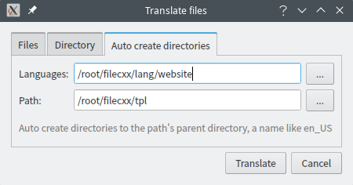

[Englisch](./README.md)\|[Vereinfachtes Chinesisch](./README.zh-CN.md)\|[traditionelles Chinesisch](./README.zh-TW.md)\|[Koreanisch](./README.ko.md)\|[Nö](./README.hi.md)\|[Arabisch](./README.ar.md)\|[Französisch](./README.fr.md)\|[Russisch](./README.ru.md)\|[Latein](./README.la.md)\|[japanisch](./README.ja.md)\|[Italienisch](./README.it.md)\|[Deutsch](./README.de.md)\|[Spanisch](./README.es.md)\|[Schwedisch](./README.sv.md)

# 

File Centipede ist ein All-In-One-Internet-Datei-Upload/Download-Manager, BitTorrent-Client, WebDAV-Client, FTP-Client und SSH-Client.

Es ist so konzipiert, dass es schnell, anpassbar und benutzerfreundlich ist.

Es unterstützt mehrere Protokolle und enthält viele nützliche Hilfstools wie HTTP-Requester, Dateizusammenführung und Encoder.

Mit der Browserintegration können Sie Audio und Videos von Websites herunterladen, sogar verschlüsselte Videos.

(Es ist kostenlos ohne Werbung)

Webseite:<http://filecxx.com>

Armaturenbrett:<https://w.filecxx.com>

Sponsoren:<http://www.filecxx.com/en_US/sponsors.html>

## Bildschirmfoto

#### Datei Tausendfüßler

#### Aufgabe hinzufügen

#### Aufgabe bearbeiten

#### Dialog bestätigen

#### Katalog hinzufügen

#### Einstellungen

#### Proxy-Einstellungen

#### Site-Regeln

#### Filter

#### Adresse aktualisieren

#### Torrent erstellen

#### Erlaubte Höchstgeschwindigkeit

#### Übersetzungstool

#### HTTP-Tool

#### Prüfsummen-Tool

## Screenshots von Browsererweiterungen

#### Videoleiste

#### Videobereich

#### Audios-Panel

## Merkmale

-   HTTP-, HTTPS-Protokoll (grundlegende Funktionen wie gzip, wiederaufnehmbar, Mehrfachverbindungen werden nicht aufgeführt.) 1.0
-   FTP, FTPS-Protokoll 1.0
-   Magnet, HASH-Adresse 1.0
-   Bit Torrent 1.0
-   Andere benutzerdefinierte Protokolle wie Thunder, Flashget, qqdl 1.0
-   JSON-formatierte Adresse 1.0
-   m3u8-Streamtask 1.0
-   Stream-Aufgabe AES-128-Entschlüsselung (SAMPLE-AES-Entschlüsselung wird noch nicht unterstützt) 1.0
-   HTTP-Cookie, Header, User-Agent mit Benutzeranpassung 1.0
-   Torrent-Seeding-Limit 1.0
-   Transfer-Task-Konfiguration 1.0 dynamisch bearbeiten
-   Anti-Blutegel 1.0
-   Abgelaufene Adresse aktualisieren 1.0
-   Kataloge 1.0
-   Download begrenzen, Upload-Geschwindigkeit 1.0
-   Benutzerdefinierte Adresse erstellen (filec, fileu) 1.0
-   Proxy-Verwaltung 1.0
-   Filter anpassen 1.0
-   Trackerverwaltung 1.0
-   Aufgabendetails 1.0
-   Torrent aus Aufgabe 1.0 exportieren
-   Mehrsprachigkeit 1.0
-   Einstellung für Warteschlange oder unbegrenzte Parallelität 1.0
-   Chrome-Browser-Integration 1.0
-   Firefox-Browser-Integration 1.0
-   Erfassen Sie Videos und Audios von der Webseite 1.0
-   Finden Sie alle Magnete von Webseite 1.0
-   Übersetzungstool 1.0
-   HTTP-Tool 1.0
-   URI-Kodierungs-/Dekodierungstool 1.0
-   Base64-Codierungs-/Decodierungstool 1.0
-   Regex-Testtool 1.0
-   Torrent 1.0 erstellen
-   Torrent zum Magnet-Tool 1.0
-   Werkzeug Magnet zum Torrent 1.0
-   Dateizusammenführungstool 1.0
-   Statistik 1.0
-   Laden Sie alle Links von der Webseite 1.6 herunter
-   SSH, SFTP-Protokoll 2.0
-   curl, wget, aria2, Axel-Befehlszeile 2.0
-   WebDAV-Protokoll 2.0
-   Datei hochladen 2.0
-   Upload-Verzeichnis 2.0
-   Verzeichnis 2.0 herunterladen
-   Voll funktionsfähiger WebDAV(s)-Dateimanager 2.0
-   Voll funktionsfähiger FTP(s)-Dateimanager 2.0
-   Voll funktionsfähiger SSH(sftp)-Dateimanager 2.0
-   Persistente Dateibrowser-Caches 2.0
-   Platzordnung 2.1
-   Prüfsummen-Tool 2.3
-   Remote-Download 2.6

## Quellcode

Der vollständige Quellcode von FileU ist im Verzeichnis „source_code“ zu finden.

Es dient nur zu Demonstrationszwecken, die im Projekt verwendeten abhängigen Bibliotheken sind nicht Open Source.

Es hat sich gezeigt, dass das Schreiben von Benutzeroberflächen in C++ erheblich einfacher sein könnte als in HTML und JavaScript, ohne die Leistung zu beeinträchtigen.

(wie in den .sml-Dateien im Verzeichnis "UI" zu sehen).

## Übersetzen

Wenn Ihnen diese Software gefällt, können Sie helfen, indem Sie das in der Software bereitgestellte Übersetzungstool verwenden, um sie in andere Sprachen zu übersetzen.

Dadurch wird die Software für Menschen zugänglicher, die andere Sprachen sprechen als die, in der sie ursprünglich geschrieben wurde. Ihr Beitrag wäre sehr willkommen.

## Sprachdateien

-   Webseite: "lang/website/\*.lang"
-   Software: "lang/software/\*.lang"
-   Browsererweiterung: "lang/browser_extension/\*.lang"

#### Wie übersetze ich die Website?

| Sprache                   | @                                                                                        |
| :------------------------ | :--------------------------------------------------------------------------------------- |
| Russisch                  | [@vanja-san](https://github.com/vanja-san)[@ Den1704](https://github.com/Den1704)        |
| traditionelles Chinesisch | [@bär0316](https://github.com/bear0316)[@Postbote1Jahr](https://github.com/postman1year) |
| Französisch               | [@kasich](https://github.com/XIAA25)                                                     |
| Niederländisch            | [@kasich](https://github.com/XIAA25)                                                     |
| Koreanisch                | [@VenusGirl](https://github.com/VenusGirl)                                               |
| Vietnamesisch             | [@vuongtuha](https://github.com/vuongtuha)                                               |
| Türkisch                  | [@geeede](https://github.com/geeede)                                                     |
| Indonesisch               | [@gigglylo](https://github.com/gigglylo)                                                 |

## Opensource libraries

[Schub](https://www.boost.org)[Qt](https://qt.io/)[libtorrent](https://www.libtorrent.org)
